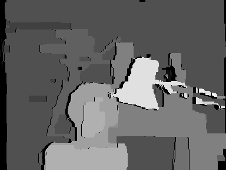
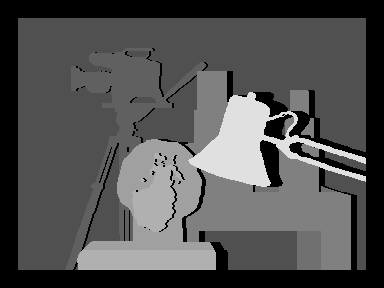
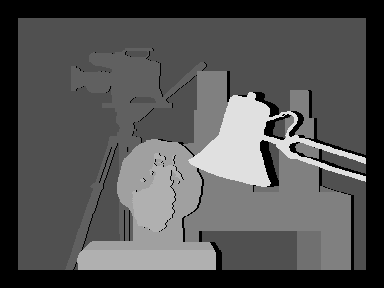
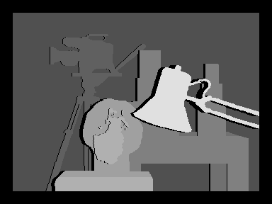
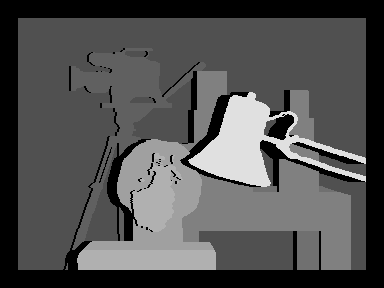

# Converts a Disparity Map from Grayscale to Color
Most basic or traditional stereo-matching algorithms generate disparity maps without explicitly modeling or handling occluded pixels, which often leads to unreliable estimates in occluded regions.
This program, takes a disparity map and tries to find occluded regions and creates a new disparity map that displays the occluded pixels in black.

## Input Image
The disparity map that used as input.

   

## Output Image
The disparity map with occluded regions that created at the output.

   

## Tsukuba Ground Truth Image
In the same way, the following ground truth disparity maps between two Tsukuba image views have been created.

   
  reference image = right, disparity levels = 32

   
  reference image = right, disparity levels = 16

   
  reference image = left, disparity levels = 16

   
  reference image = left, disparity levels = 32

